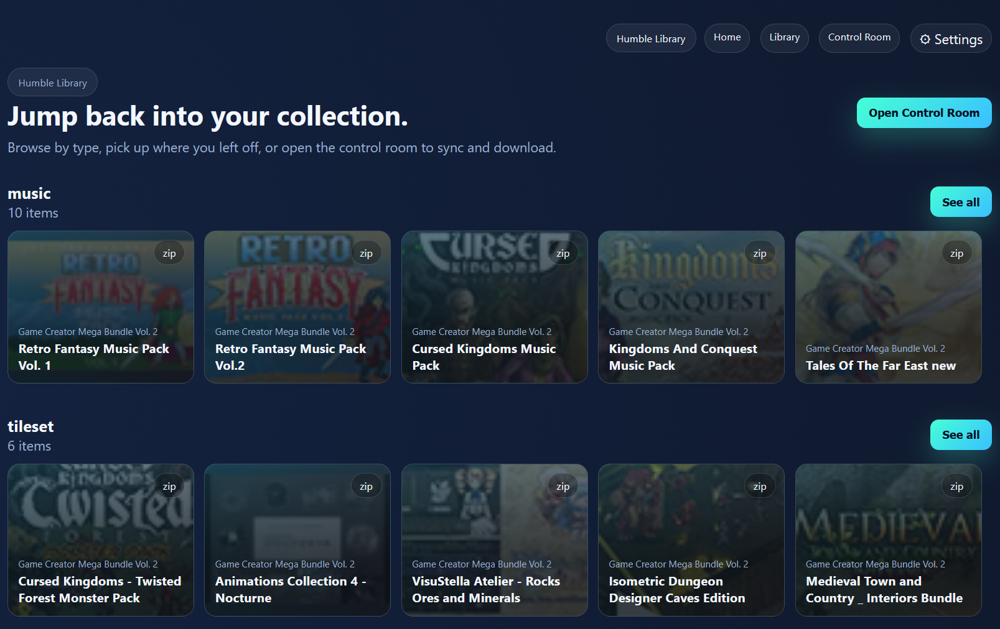
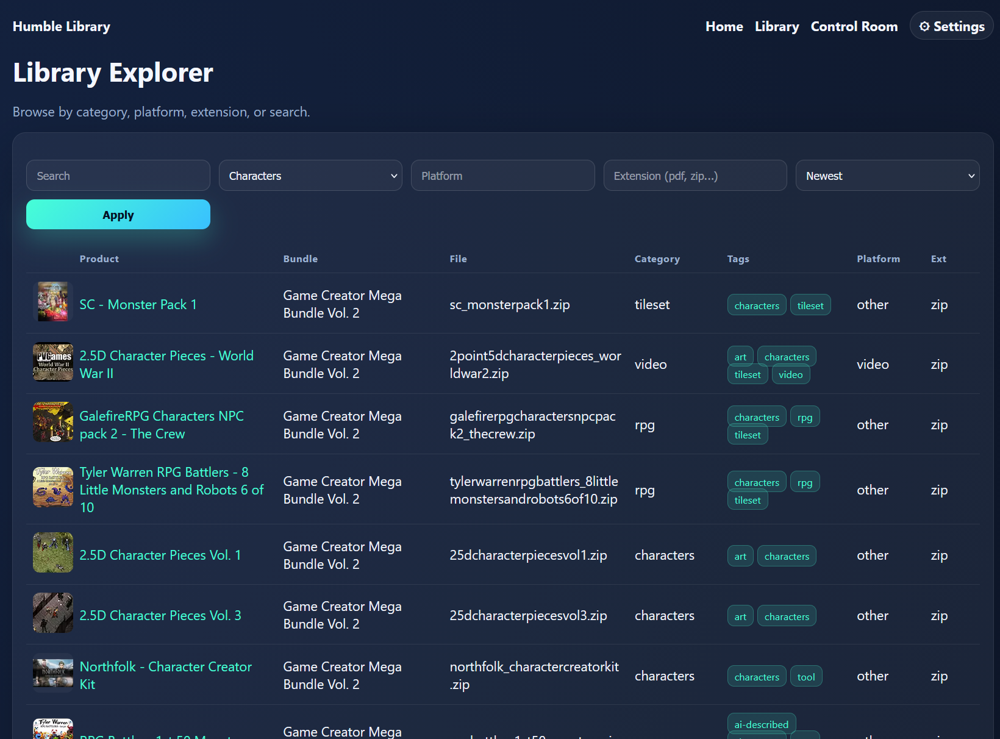
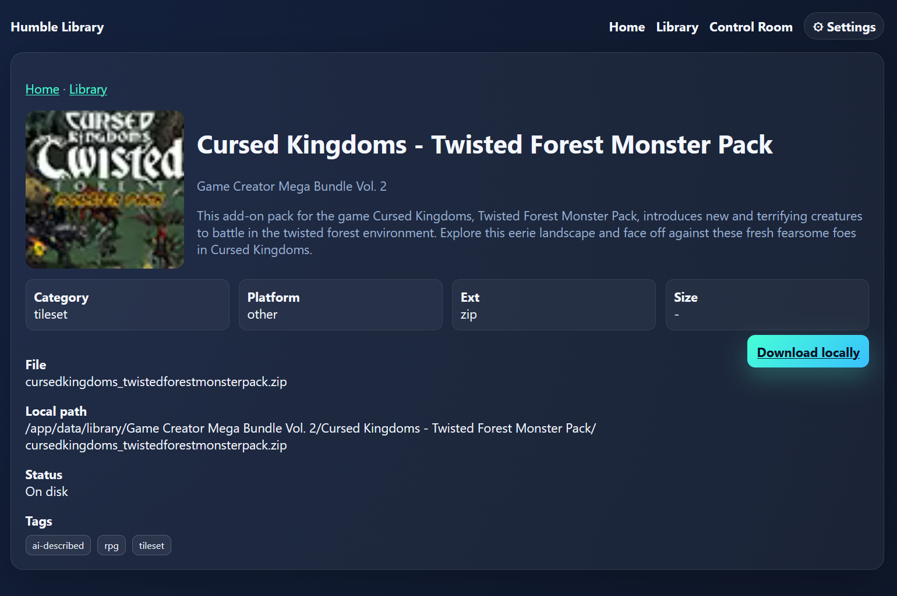
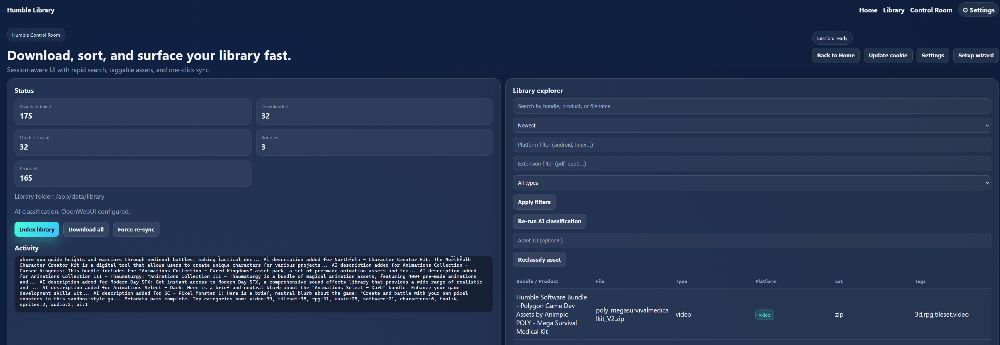
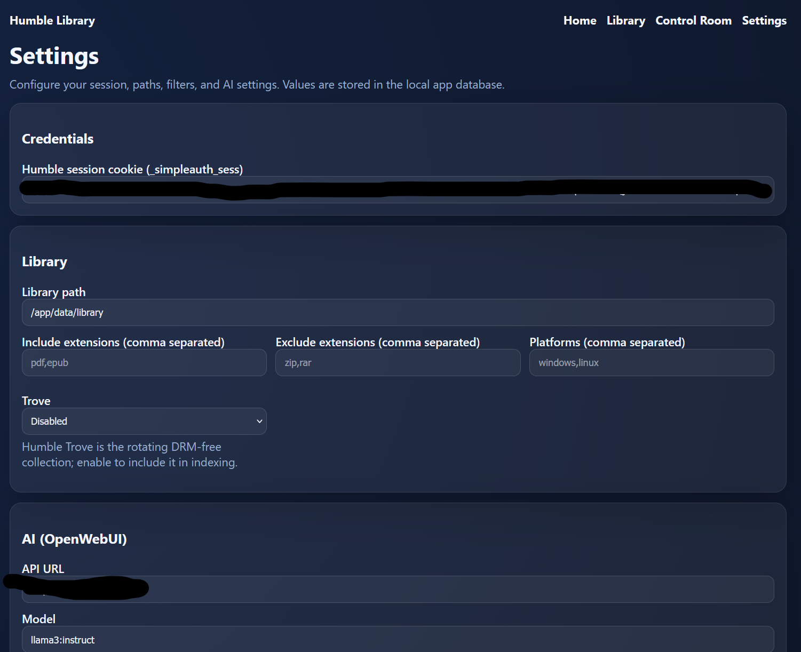

# Humble Library UI

_Disclaimer: Generated with the help of GenAI to build a usable tool; not conceived as a traditional software project._

Self-hosted web UI for indexing, browsing, tagging, and downloading your Humble Bundle library. Includes a Tauri desktop shell, trusted-header auth support, OpenWebUI-powered metadata, and Docker deployment.



## Features
- Fast search/filter over local SQLite index (bundle/product/file/category/platform/ext/tags).
- Rich categories/tags (tilesets/sprites/characters/etc), OpenWebUI-backed classification and descriptions.
- Download manager with progress, skip detection, and disk reconciliation.
- Settings UI for session cookie, library path, filters, OpenWebUI, trusted header auth.
- Tauri desktop wrapper that bundles the server + UI.
- Docker Compose for headless hosting; volumes for DB/state and downloads.

## How to run (three modes)

### 1) Direct web server (Poetry/pip)
```bash
poetry install          # or pip install -e .
poetry run hbd-ui       # or python -m humblebundle_downloader.ui_server
# open http://localhost:8000
```
Data lives in `data/assets.db`; downloads go wherever you set in Settings.

### 2) Desktop (Tauri wrapper)
```bash
cd desktop/tauri-app
npm install
npm run tauri           # dev window opens http://127.0.0.1:8000
```
The launcher bootstraps a local `.venv`, starts the server, and opens a native window. Use Settings to configure; data still lives under `data/`.

### 3) Docker container
Build:
```bash
cd docker
docker compose build    # image humble-ui:latest
```
Run (with host mounts):
```bash
docker run -p 8000:8000 \
  -v /host/humble-data:/app/data \
  -v /host/humble-library:/library \
  humble-ui:latest
```
Or via compose: `docker compose up`. `/app/data` holds DB/state; `/library` is your download path.

On first load you’ll be redirected to `/settings`. Paste your `_simpleauth_sess` cookie, set a library path, and save. Use “Open token wizard” if you need the guided flow.

## Trusted Header Auth (reverse proxy)
- Configure a header name in `/settings` (e.g., `X-Forwarded-User`).
- Presence of that header allows access; value is not validated (assumed trusted by your proxy).
- The UI shows the user value in the top nav badge; `/api/me` returns it.

## Pages
- Home: highlights by category, links to Library/Admin/Settings.
- Library: search/filter/sort, tags shown, rows link to Item detail.
- Item: cover/metadata/tags/download if on disk.
- Control Room (Admin): stats, logs, sync/download controls, AI classification/description buttons, wizard.
- Settings: session cookie, library path, filters, OpenWebUI URL/model/key, trusted header config, token wizard button.

## Environment & Config
Settings are stored in `data/assets.db` (no `.env` required):
- Humble `_simpleauth_sess` cookie
- Library path, include/exclude extensions, platforms, Trove toggle
- OpenWebUI URL/model/API key
- Trusted header name (optional)

## Desktop (Tauri)
See “How to run” above; Tauri wraps the same server with a bundled `.venv`.

## Development
```bash
poetry install
python -m humblebundle_downloader.ui_server   # or poetry run hbd-ui
```
Initial metadata runs every ~2 minutes; force refresh via `/api/sync` with `{"update": true}`.

## Screenshots
- Home: 
- Library: 
- Item detail: 
- Control Room: 
- Settings: 
